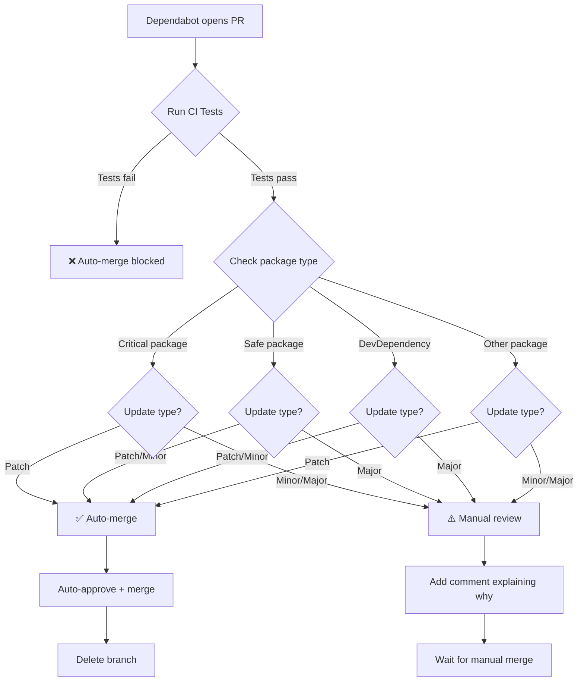

# Dependabot Auto-Merge Rules

This document explains the automatic merge rules for Dependabot PRs.

## 🎯 Decision Matrix

### 🔴 CRITICAL PACKAGES - Nur Patch Auto-Merge

**Never auto-merge minor/major updates:**
- `next` - Core framework, breaking changes häufig
- `react` / `react-dom` - Breaking changes bei minor versions
- `framer-motion` - Animation library, API changes
- `tailwindcss` - CSS framework, class changes

**Auto-merge Policy:**
- ✅ Patch (14.2.5 → 14.2.6) - Auto-merge
- ⚠️ Minor (14.2.5 → 14.3.0) - Manual review
- ⚠️ Major (14.2.5 → 15.0.0) - Manual review

**Example:**
```
✅ next 14.2.31 → 14.2.32 (patch) - AUTO-MERGE
⚠️ next 14.2.31 → 14.3.0 (minor) - MANUAL REVIEW
⚠️ next 14.2.31 → 15.0.0 (major) - MANUAL REVIEW
```

---

### 🟢 SAFE PACKAGES - Patch + Minor Auto-Merge

**These packages are safe to auto-update:**
- `kmuc-dev-cli` - Internal CLI tool
- `lucide-react` - Icon library (backwards compatible)
- `clsx` - Tiny utility (stable API)
- `class-variance-authority` - Utility library
- `tailwind-merge` - Utility library
- `tailwindcss-animate` - Animation plugin

**Auto-merge Policy:**
- ✅ Patch (0.5.1 → 0.5.2) - Auto-merge
- ✅ Minor (0.5.1 → 0.6.0) - Auto-merge
- ⚠️ Major (0.5.1 → 1.0.0) - Manual review

**Example:**
```
✅ kmuc-dev-cli 2.2.1 → 2.2.2 (patch) - AUTO-MERGE
✅ kmuc-dev-cli 2.2.1 → 2.3.0 (minor) - AUTO-MERGE
⚠️ kmuc-dev-cli 2.2.1 → 3.0.0 (major) - MANUAL REVIEW
```

---

### 🔵 DEV DEPENDENCIES - Patch + Minor Auto-Merge

**All devDependencies are auto-merged for patch + minor:**
- `@types/*` - TypeScript definitions
- `eslint` / `eslint-*` - Linting tools
- `prettier` - Code formatter
- `typescript` - TypeScript compiler
- `autoprefixer` / `postcss` - Build tools
- `serve` - Dev server

**Auto-merge Policy:**
- ✅ Patch (5.9.1 → 5.9.2) - Auto-merge
- ✅ Minor (5.9.1 → 5.10.0) - Auto-merge
- ⚠️ Major (5.9.1 → 6.0.0) - Manual review

**Example:**
```
✅ typescript 5.9.3 → 5.9.4 (patch) - AUTO-MERGE
✅ typescript 5.9.3 → 5.10.0 (minor) - AUTO-MERGE
⚠️ typescript 5.9.3 → 6.0.0 (major) - MANUAL REVIEW
```

---

### 🟡 FALLBACK RULE - Nur Patch Auto-Merge

**For all other packages not in above lists:**
- ✅ Patch updates - Auto-merge
- ⚠️ Minor updates - Manual review
- ⚠️ Major updates - Manual review

---

## 🔄 Workflow Process



---

## 📋 CI Checks Before Auto-Merge

All PRs must pass these checks:

1. ✅ `pnpm typecheck` - TypeScript compilation
2. ✅ `pnpm lint` - ESLint checks
3. ✅ `pnpm build` - Production build

**If any check fails → No auto-merge**

---

## 🎛️ Adding/Removing Packages from Lists

### To add a package to CRITICAL list:

Edit `.github/workflows/dependabot-auto-merge.yml`:

```bash
CRITICAL_PACKAGES=(
  "next"
  "react"
  "react-dom"
  "framer-motion"
  "tailwindcss"
  "your-new-package"  # Add here
)
```

### To add a package to SAFE list:

```bash
SAFE_PACKAGES=(
  "kmuc-dev-cli"
  "lucide-react"
  "clsx"
  "your-safe-package"  # Add here
)
```

---

## 📊 Example Scenarios

### Scenario 1: Security Patch in Next.js
```
PR: bump next from 14.2.31 to 14.2.32
Type: Patch
Package: Critical
Result: ✅ AUTO-MERGE (security patches always safe)
```

### Scenario 2: Minor Update in Next.js
```
PR: bump next from 14.2.31 to 14.3.0
Type: Minor
Package: Critical
Result: ⚠️ MANUAL REVIEW (could have breaking changes)
Comment: "Critical package with version-update:semver-minor"
```

### Scenario 3: Minor Update in kmuc-dev-cli
```
PR: bump kmuc-dev-cli from 2.2.1 to 2.3.0
Type: Minor
Package: Safe
Result: ✅ AUTO-MERGE (internal tool, safe to update)
```

### Scenario 4: Patch Update in Unknown Package
```
PR: bump some-new-lib from 1.2.3 to 1.2.4
Type: Patch
Package: Not in lists
Result: ✅ AUTO-MERGE (patch updates safe by default)
```

### Scenario 5: Major Update in TypeScript
```
PR: bump typescript from 5.9.3 to 6.0.0
Type: Major
Package: DevDependency
Result: ⚠️ MANUAL REVIEW (major version changes)
Comment: "DevDependency major update - needs review"
```

---

## 🚨 When Auto-Merge is Blocked

You'll receive a comment on the PR:

```
⚠️ Manual review required

Reason: Critical package with version-update:semver-minor - needs manual review

Package: next
Update Type: version-update:semver-minor
Dependency Type: direct:production

Please review the changes and merge manually if safe.
```

**What to do:**
1. Review the changelog of the package
2. Check for breaking changes
3. Test locally if needed
4. Merge manually with: `gh pr merge <PR-NUMBER> --squash --delete-branch`

---

## 🔧 Maintenance

**Review this policy quarterly** to ensure:
- Critical packages list is up-to-date
- Safe packages haven't introduced breaking changes
- New dependencies are categorized correctly

Last updated: 2025-11-08
