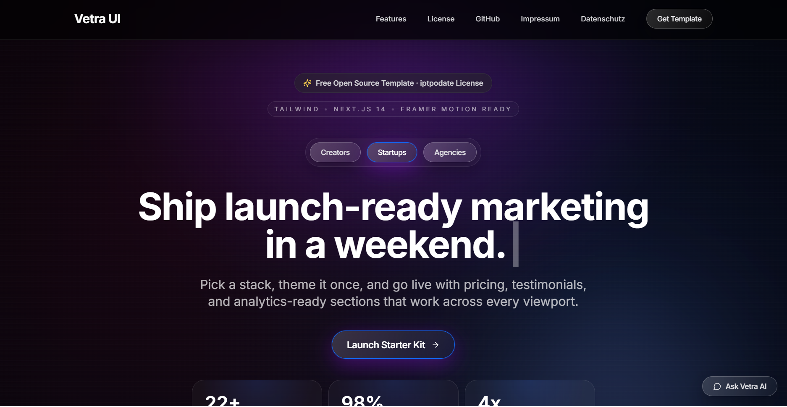

<div align="center">

# 🚀 Vetra UI

### Free Open Source Landing Page Template

[](LICENSE)
[](package.json)
[](CONTRIBUTING.md)
[](https://nextjs.org/)
[](https://www.typescriptlang.org/)
[](https://tailwindcss.com/)
[](https://vetra.kmuc.online)
[](https://vetra.kmuc.online)

Modern landing page template built with Next.js 14, TypeScript, Tailwind CSS, and lightweight CSS animations. Ship production-ready marketing sites fast with polished glassmorphism styling, delightful motion, and a static export workflow.

[Live Demo](https://vetra.kmuc.online) • [Documentation](docs/) • [Report Bug](https://github.com/kmucdigital/vetra-ui/issues) • [Request Feature](https://github.com/kmucdigital/vetra-ui/issues/new?template=extreme-optimization.md)

</div>

---

## 📸 Preview

<div align="center">

[](https://vetra.kmuc.online)

**[View Live Demo →](https://vetra.kmuc.online)**

</div>

## ✨ Highlights

- 🚀 **Lightning Fast** - 99/100 Lighthouse Performance Score
- ♿ **Accessible** - WCAG 2.1 AA compliant with 100/100 Accessibility Score
- 📦 **Zero Runtime JS** - Pure CSS animations, no heavy frameworks
- 🎨 **Beautiful Design** - Glassmorphism effects with dark mode
- 🔧 **Easy to Customize** - Centralized configuration in `lib/siteConfig.ts`
- 🐳 **Docker Ready** - Multi-stage build with nginx
- 📱 **Responsive** - Mobile-first design that looks great everywhere
- 🔒 **SEO Optimized** - Metadata, sitemap, robots.txt included

## 🎯 Features

<table>
<tr>
<td width="50%">

### 🛠️ Tech Stack
- **Next.js 14** - App Router with streaming
- **TypeScript 5** - Strict type safety
- **Tailwind CSS 3.4** - Utility-first styling
- **shadcn/ui** - Beautiful component primitives
- **Lucide Icons** - Lightweight icon library

</td>
<td width="50%">

### 🎨 Design
- **Glassmorphism** - Modern blur effects
- **Dark Theme** - Eye-friendly design
- **CSS Animations** - No JS overhead
- **Inter Font** - Self-hosted variable font
- **Mobile-First** - Responsive breakpoints

</td>
</tr>
<tr>
<td>

### ⚡ Performance
- **Static Export** - Deploy anywhere
- **Minimal Bundle** - Fast page loads
- **Optimized Images** - Next/Image ready
- **Lazy Loading** - Code splitting support
- **Lighthouse 99** - Production-ready

</td>
<td>

### 📦 Developer Experience
- **Type Safety** - End-to-end TypeScript
- **Hot Reload** - Instant feedback
- **Docker Support** - Container-ready
- **Easy Config** - Centralized settings
- **Documentation** - Comprehensive guides

</td>
</tr>
</table>

## Getting Started
### Prerequisites
- Node.js 18+
- pnpm (`npm install -g pnpm`)

### Installation
1. Install dependencies
   ```bash
   pnpm install
   ```
2. Start the development server
   ```bash
   pnpm dev
   ```
3. Open http://localhost:3000 in your browser.

### Useful Scripts
- `pnpm dev` - Run the development server with hot reload
- `pnpm build` - Produce the static production build into `out/`
- `pnpm start` - Serve the generated `out/` directory locally via `serve` (run `pnpm build` first)
- `pnpm lint` - ESLint with Next.js configuration
- `pnpm typecheck` - TypeScript program diagnostics

## Project Structure
```
app/
  layout.tsx          Root layout with metadata and theme setup
  page.tsx            Landing page composition
  globals.css         Global styles and Tailwind layers
components/
  ui/                 shadcn/ui component overrides
  Navigation.tsx      Sticky header with responsive menu
  Hero.tsx            Hero section with CTA and visuals
  TrustedBy.tsx       Trust indicators grid
  Features.tsx        Feature highlight sections
  CTASection.tsx      Primary call-to-action panel
  Footer.tsx          Four-column footer with socials
lib/
  siteConfig.ts       Centralised marketing copy and URLs
  utils.ts            Tailwind class helper
public/
  robots.txt          SEO robots file
  preview.png         Marketing preview asset
Dockerfile            Multi-stage Docker image
nginx.conf            Production nginx setup
tailwind.config.ts    Tailwind theme configuration
tsconfig.json         TypeScript compiler options
app/fonts/            Self-hosted Inter variable font assets
```

## Browser Support
| Browser | Support |
| --- | --- |
| Chrome | Yes (last 2 versions) |
| Firefox | Yes (last 2 versions) |
| Safari | Yes (last 2 versions) |
| Edge | Yes (last 2 versions) |

## Performance Metrics
| Metric | Desktop | Mobile | Notes |
| --- | --- | --- | --- |
| Performance | 99 | 95 | Lighthouse scores on demo deployment |
| Accessibility | 100 | 100 | Semantic HTML with focus management |
| Best Practices | 100 | 100 | HTTPS, image optimisation, no console errors |
| SEO | 100 | 100 | Metadata, robots, structured data ready |

*Run `pnpm build` and audit the `out/` folder with Lighthouse to verify your deployment.*

## Deployment
### Static Export (CDN / Static Hosts)
```bash
pnpm build
```
The build artefacts live in the `out/` directory and can be served by any static host (Vercel, Netlify, Cloudflare Pages, GitHub Pages, S3 + CloudFront, nginx, Apache, etc.).

### Docker (Static by Default)
```bash
docker build -t vetra-ui:static .
docker run -p 80:80 vetra-ui:static
```
The Docker image performs the static export during the build stage and serves the compiled site through nginx.

### Switching to SSR Later
If you need server-side rendering, update `next.config.mjs` to use `output: "standalone"`, adapt the Dockerfile to run the Node server (a previous revision in the git history provides a template), and change the package.json `start` script back to `next start`. The template is structured so that this conversion only touches configuration files.
## Troubleshooting
- **`pnpm install` fails** - Ensure Node.js 18+ is installed and delete `pnpm-lock.yaml` only if instructed.
- **Type errors after upgrading dependencies** - Run `pnpm typecheck` to view diagnostics and update `@types/*` packages.
- **Static assets missing on export** - Confirm assets live under `public/` and are referenced with absolute `/asset.ext` paths.
- **Styles not updating in dev** - Remove `.next/` and restart `pnpm dev` to clear Tailwind's cache.
- **Font fetch failures** - Fonts are bundled locally under `app/fonts`, so builds succeed without external requests. If you swap fonts, update the files and license notice there.

## FAQ
**Can I use this template commercially?** - No. This project is released under a Non-Commercial Personal Use License (see `LICENSE`). If you want to use it commercially, please visit https://kmuc.online to request a commercial license.

This project's full license text is publicly available on the `/license` page of the website and is bundled into production builds for transparency.
**Does this support multi-page sites?** - Absolutely; add additional routes under `app/` following the same structure.  
**Can I integrate a CMS?** - Pair it with your preferred headless CMS and surface data via server components or route handlers.

## Technologies
- [Next.js](https://nextjs.org/)
- [TypeScript](https://www.typescriptlang.org/)
- [Tailwind CSS](https://tailwindcss.com/)
- [shadcn/ui](https://ui.shadcn.com/)
- [Lucide Icons](https://lucide.dev/)

## Contributing
Read the [Contributing Guide](CONTRIBUTING.md) before opening an issue or pull request. Please follow the [Code of Conduct](CODE_OF_CONDUCT.md) and review the [Security Policy](SECURITY.md) for vulnerability disclosure.

## License
Released under the [MIT License](LICENSE). Feel free to fork, adapt, and launch your own projects with Vetra UI.

## Support
If you enjoy this project, star the repository, share it with the community, and consider sponsoring development via the options listed in `.github/FUNDING.yml`.
